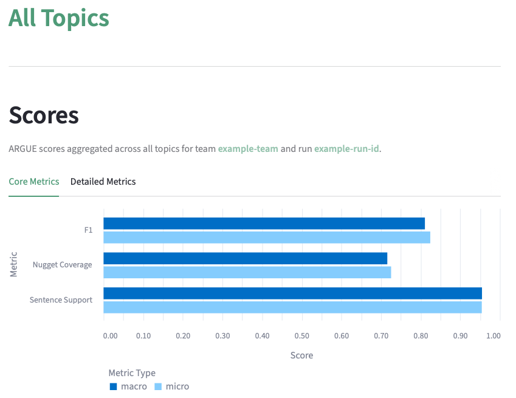
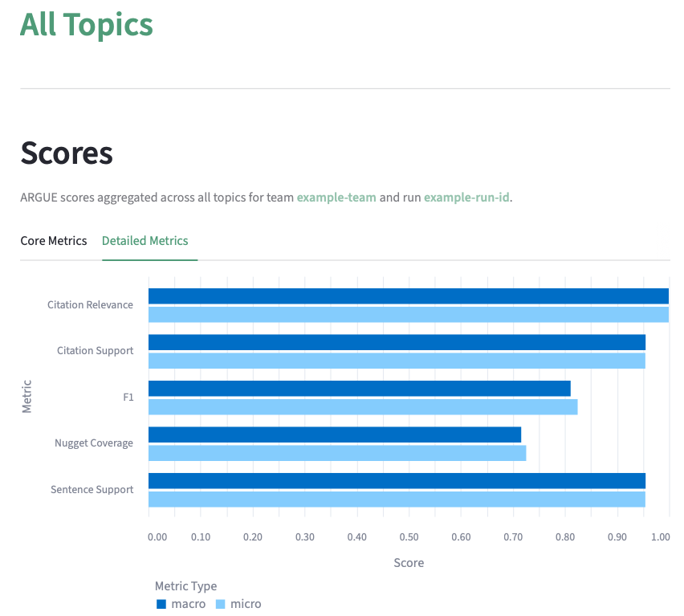
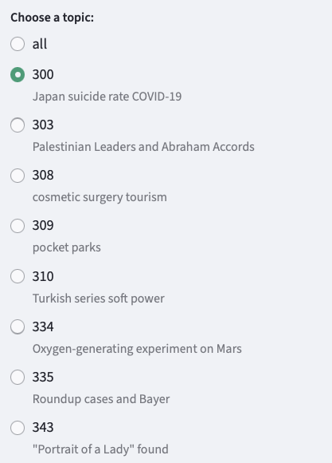
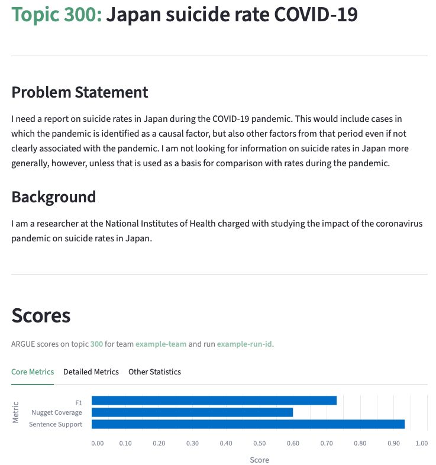
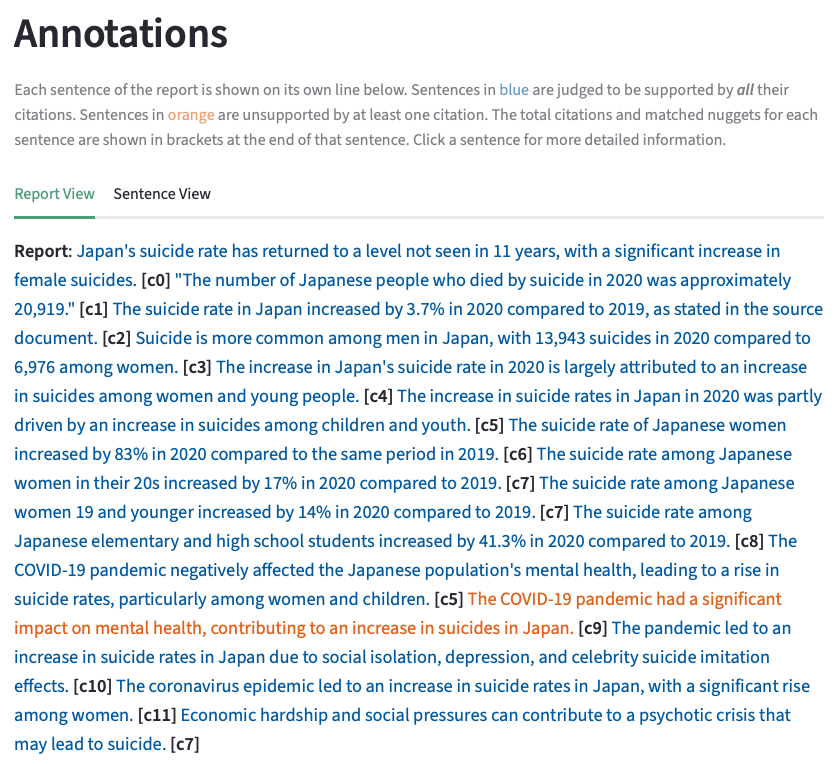
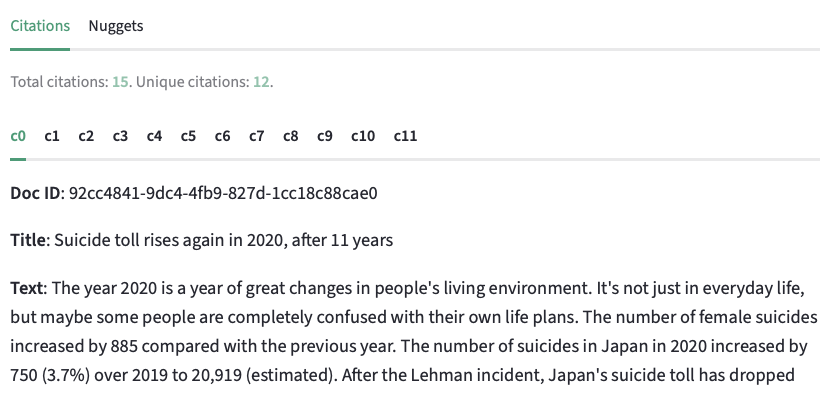
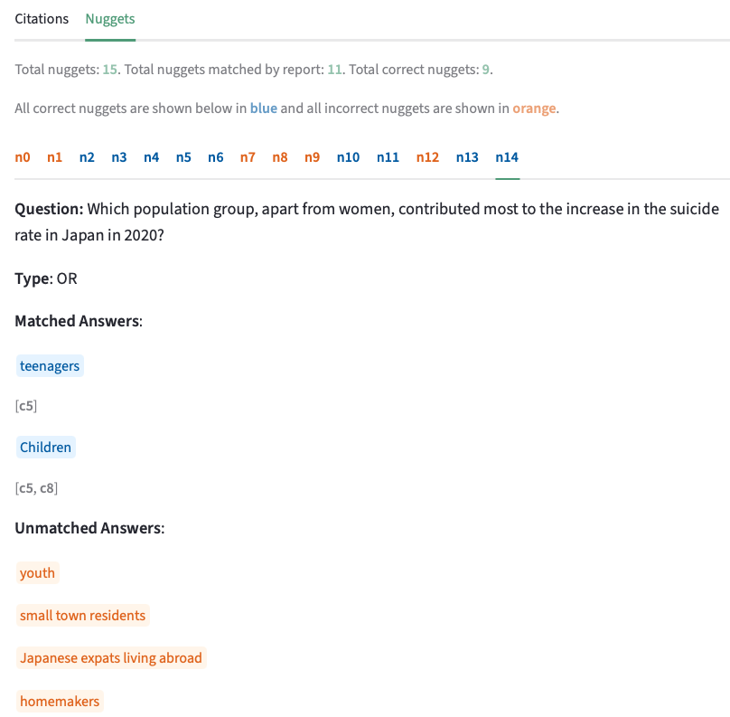
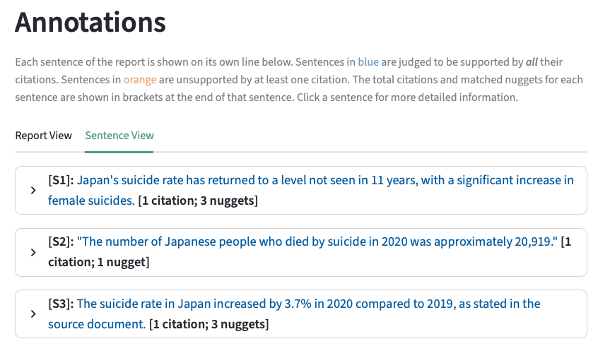
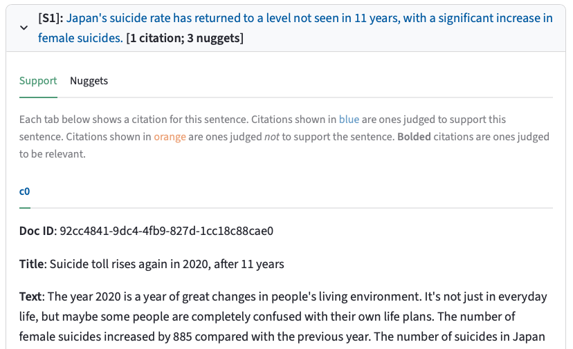
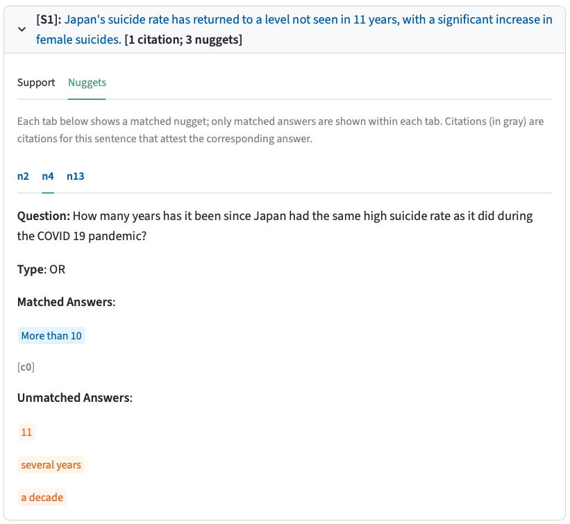

# ARGUE-Viz: A visualizer for Auto-ARGUE

This app provides a means of visualizing ARGUE scores and judgments produced by the [auto-argue](https://github.com/hltcoe/auto-argue) package.

## Installation

### Option 1 (Preferred)

Run the setup script: `source setup.sh`

This will create and activate a new virtual environment (`argue-viz`) and install the dependencies in `requirements.txt`.

(The environment can be deactivated at any time by simply running `deactivate`.)

### Option 2

Run the following commands (these are bundled in the `setup.sh` script described in **Option 1**):

0. \[Install [uv](https://docs.astral.sh/uv/getting-started/installation/) if you have not already\]
1. Create the virtual environment: `uv venv argue-viz`
2. Activate the virtual environment: `source argue-viz/bin/activate`
3. Install dependencies: `uv pip install -r requirements.txt`

## Usage

After setting up and activating the virtual environment, you can see an example visualization by running the following from the project root:

```
streamlit run src/streamlit_app.py
```

To run with arbitrary outputs from `auto-argue`, you will need to provide the following four command line arguments (which default to example files in the `assets/` directory):

- `--topic-data`: a JSONL file containing the topics on which the run was evaluated (see `assets/neuclir24-test-request.jsonl`)
- `--nuggets-dir`: a directory containing the JSON-formatted nuggets for each topic (see `assets/example-nuggets/`)
- `--judgments-data`: a JSONL file containing ARGUE judgments for the system-generated report for each topic (see `assets/example-report.judgments.jsonl`)
- `--scores-data`: a TSV file containing the ARGUE metrics for this run (see `assets/example-report.scores.tsv`)

Owing to the way Streamlit parses command line arguments, these arguments must be offset with a `--`, like so:

```
streamlit run src/streamlit_app.py -- --topic-data <my_topic_data> --nuggets-dir <my_nuggets_dir> --judgments-data <my_judgments_jsonl> --scores-data <my_scores_tsv>
```

## Understanding the Visualization

Below, we provide a walkthrough of the key components of the visualization.

### Aggregate Scores

When you start up the app, it will default to displaying some aggregate scores across *all* topics:



Here, micro- and macro-average scores are reported across all topics for the following "core" metrics:

- `Nugget Coverage`: the proportion of nuggets associated with a topic that the report for that topic correctly answers
- `Sentence Support`: the proportion of sentences judged to be supported by *each* of their citations
- `F1`: an F1 score computed from the previous two metrics

Clicking the **Detailed Metrics** tab will additionally show aggregate results for the following two metrics:

- `Citation Relevance`: the proportion of cited documents that are relevant to the topic
- `Citation Support`: the proportion of cited documents that are judged to support the sentence they are attached to




### Navigating Between Topics

To the left is a sidebar that allows you to toggle between these aggregate results and the per-topic results:



### Per-Topic Results

Selecting one of the topics from the sidebar above will show some topic-specific information, including the problem statement, user background, and metrics for that topic (with the same option to toggle between **Core** and **Detailed** metrics, with some further report statistics shown in the **Other Statistics** tab):



### Report View

Scrolling down, you'll see the **Report View** for the report produced for this topic. This shows the full text of the report with citations embedded (note: actual document identifiers are mapped to `c0, c1, ..., cN` for easier reading). As described in the gray text below, sentences that are judged *supported* by each of their citations are shown in blue, while sentences that are *unsupported* by at least one of their citations are shown in orange:



### Report View - Citations

Scrolling still further down within the **Report View**, you can see detailed information about each cited document, including its actual identifier (**Doc ID**), title (**Title**), and contents (**Text**):



### Report View - Nuggets

A sibling "Nuggets" tab to the "Citations" tab above shows detailed information about nuggets associated with the report topic (labeled `n0, n1, ..., nM`). Nuggets that are correctly answered by the report are shown in blue. Nuggets that are incorrectly answered by the report are shown in orange. Detailed information about the type of nugget (`OR` or `AND`) and the exact answers that were provided ("matched") or not ("unmatched") by the report are displayed when you click on the tab corresponding to a specific nugget:



### Sentence View

Scrolling back up to the **Report View** tab, a sibling **Sentence View** tab shows the report broken down sentence by sentence (`S1, S2, ..., SK`). Once again, sentences that are *supported* by each of their citations are shown in blue and those that are *unsupported* by at least one citation are shown in orange. At the end of each sentence is some summary information about the number of citations associated with it in the report and the number of nuggets it addresses:



### Sentence View - Support

Clicking on the dropdown for a sentence will show you the **Support** tab, which displays the **Doc ID**, **Title**, and **Text** of each citation (`c0, c1, ..., cP`) associated with that sentence. Supporting citations are shown in blue and non-supporting citations are shown in orange:



### Sentence View - Nuggets

Next to the **Support** tab is the **Nuggets** tab, which is very similar to the **Nuggets** tab in the **Report View**. Here, you will see the nuggets that are correctly answered by the sentence in blue. Nuggets not addressed by the sentence are not shown. Clicking on the tab for a nugget will show more detailed information about nugget type and matched and unmatched answers:



## Further Reading

For more details on ARGUE, please see [this paper](https://dl.acm.org/doi/abs/10.1145/3626772.3657846).

## Contact

For questions or comments, please contact Will Walden (wwalden1@jh.edu).